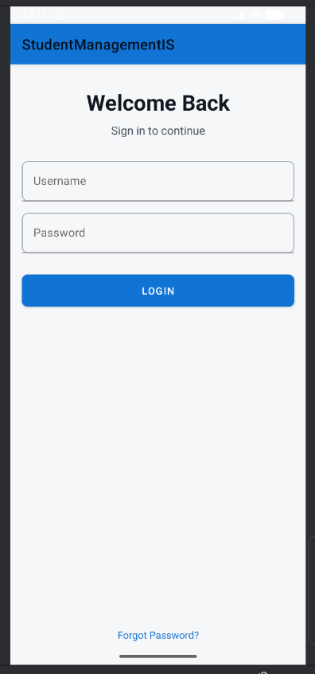
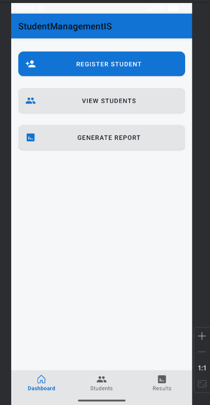
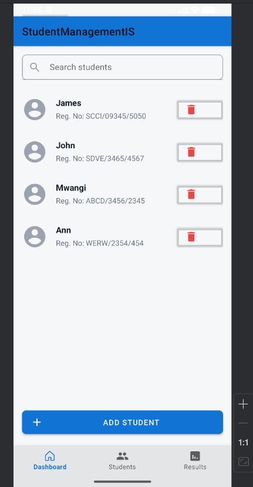
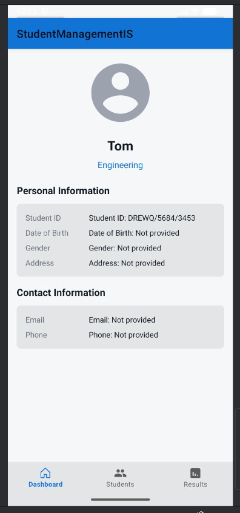

# Student-Management-Information-System-SMIS--Mobile-App-IBL23305

**Name:** Nelson Apidi 

---

## 📌 Project Structure  

SMIS-Assignment/
│
├── StudentManagementIS2/ # Android Mobile App (Frontend)
├── SMIS-Backend/ # Laravel Backend (API + Database)
├── Screenshot/ # Screenshots for both frontend and backend
└── README.md

---

## 📖 Section A – Project Overview  

This project is a **Student Management Information System (SMIS)** developed as part of the **IBL23305 assignment**.  
It consists of two main parts:  

1. **Mobile Application (Frontend)**  
   - Developed in **Kotlin (Android Studio)**.  
   - Uses **Room Database** for offline persistence.  
   - Implements **MVVM architecture**.  
   - Syncs results with backend via **Retrofit**.  

2. **Backend API (Laravel)**  
   - Developed using **Laravel (PHP)**.  
   - Uses **MySQL** as the database.  
   - Exposes RESTful API endpoints for results and student data.  
   - Provides seeders for mock data.  

---

## 📖 Section B – Features  

### 1. Mobile App (Frontend – `StudentManagementIS2/`)  

- **Login**  
  - Mocked authentication (basic username/password validation).  
  - Navigates to dashboard on success.  

- **Dashboard**  
  - Quick access to student registration, view students, and results.  
  - Bottom navigation for dashboard, students, and results.  

- **Student Management (CRUD)**  
  - Register new students (form with name, reg. number, course).  
  - View all students in RecyclerView with search and delete.  
  - View student details (full info passed via Intent).  
  - Delete with confirmation dialog + undo via Snackbar.  

- **Results Display**  
  - Fetches results from backend API (`GET /api/students/results`).  
  - Displays subject, score, and grade (color-coded).  
  - Falls back to mock data if API unavailable.  

---

### 2. Backend API (Laravel – `SMIS-Backend/`)  

- **Endpoints**  
  - `GET /api/students/results` → fetch student results.  
  - `DELETE /api/students/{id}` → delete student by ID.  

- **Database**  
  - Tables: `students`, `results`.  
  - Seeder for inserting mock data.  

- **Security**  
  - Basic authentication (extendable with Sanctum).  
  - Request validation for inputs.  

---

## ⚙️ Setup Instructions  

### Frontend (Android App)  

cd StudentManagementIS2
# Open in Android Studio and run

Backend (Laravel API)

cd SMIS-Backend
composer install
cp .env.example .env
php artisan key:generate
php artisan migrate --seed
php artisan serve

📸 Screenshots
| Login Screen | Dashboard |
|--------------|-----------|
|  |  |

| Students View | Student Profile |
|---------------|----------------|
|  |  |

Details	Results
🔗 https://github.com/semedo-nob/Student-Management-Information-System-SMIS--Mobile-App-IBL23305.git

# Student-Management-Information-System-SMIS--Mobile-App-IBL23305
